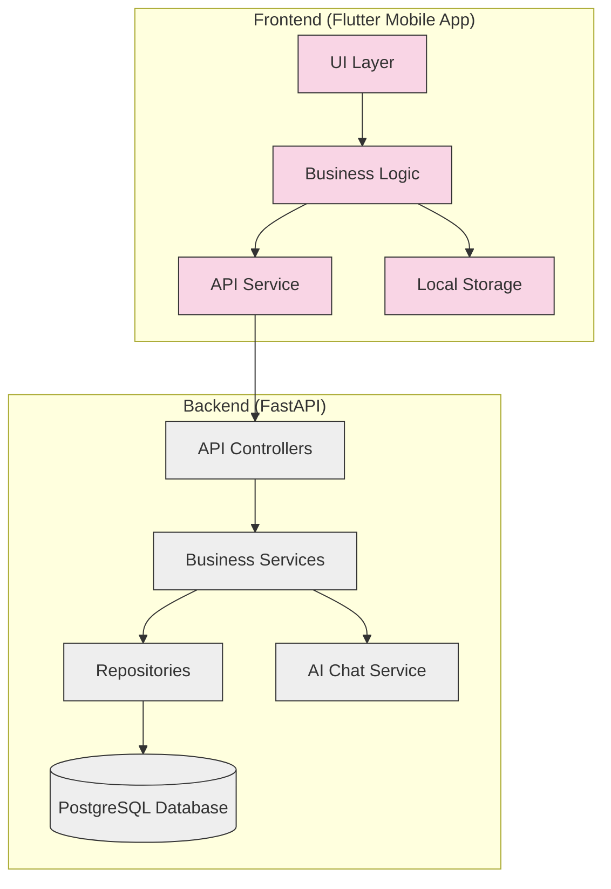
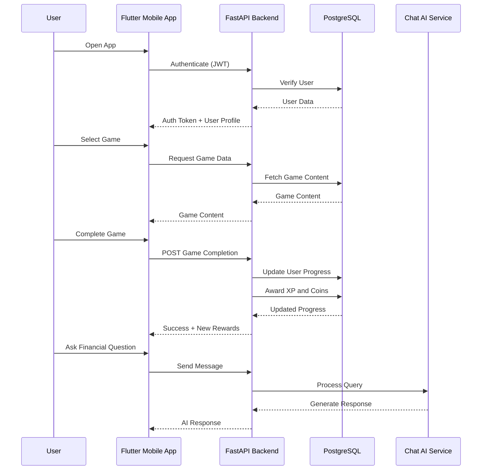
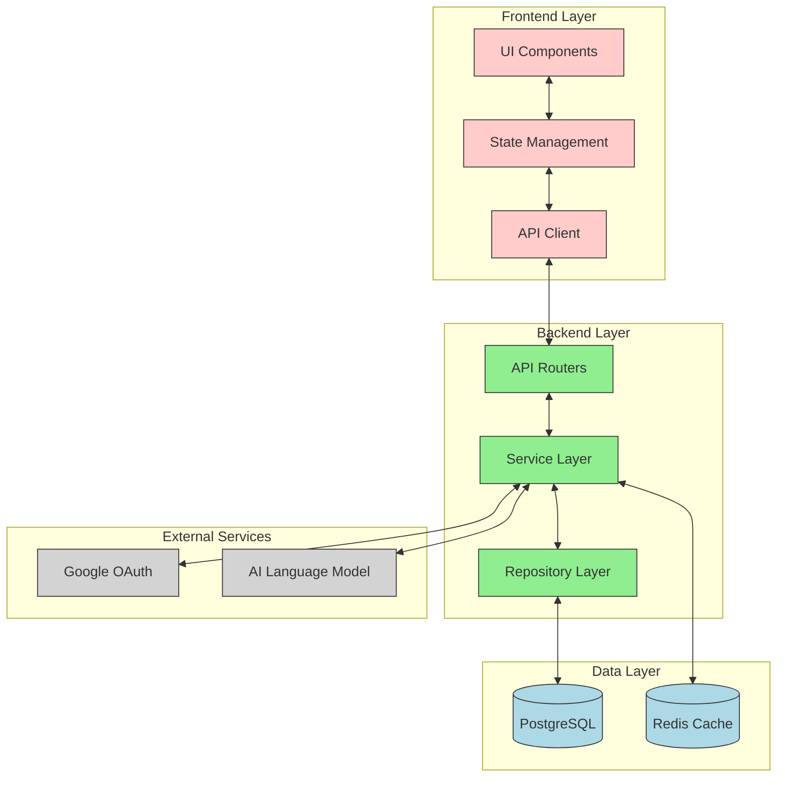
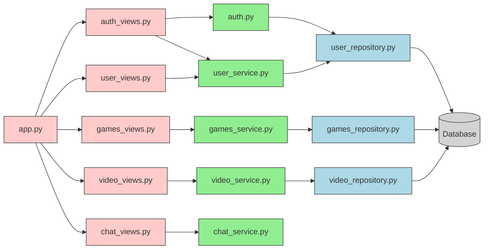
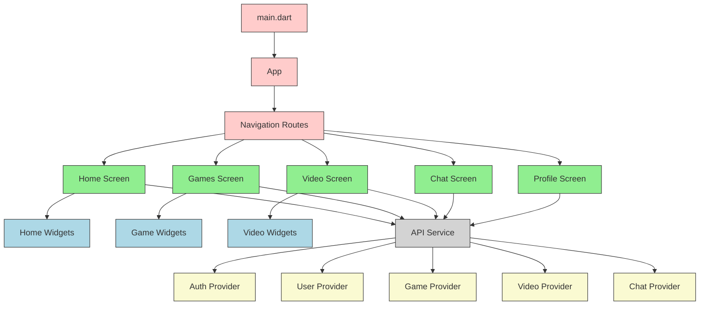
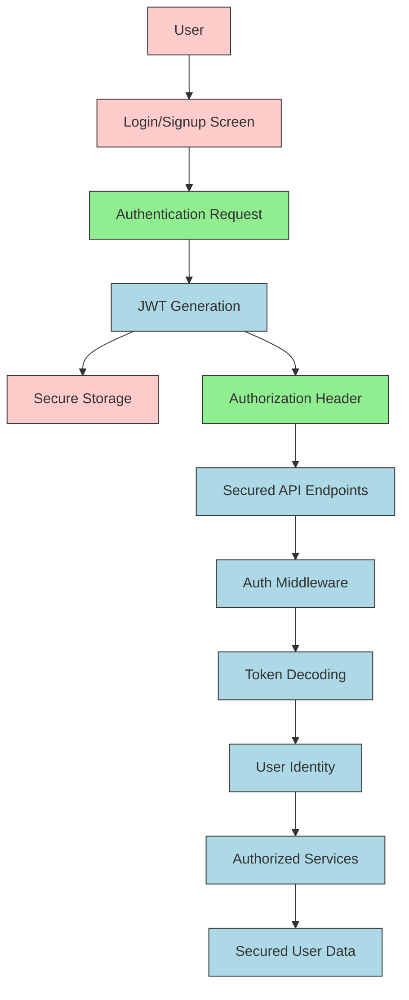
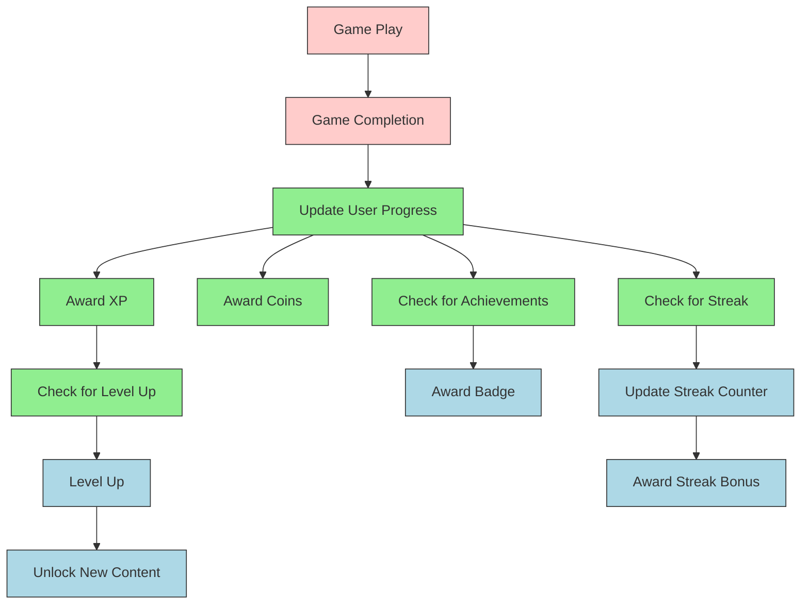
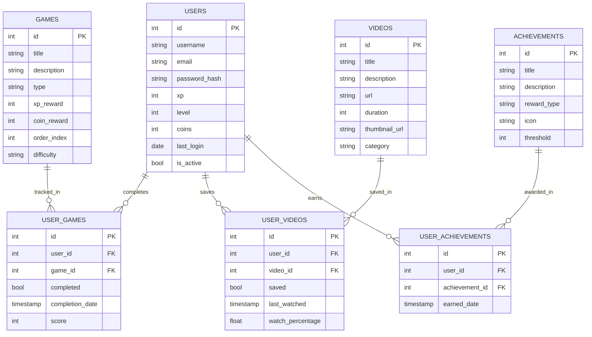
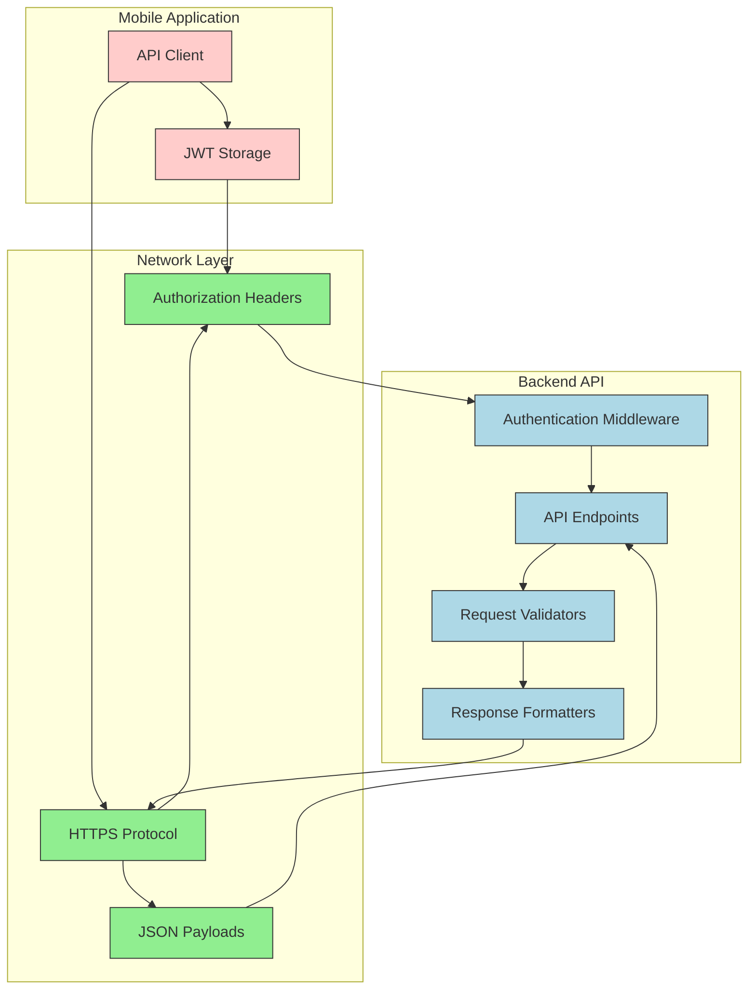
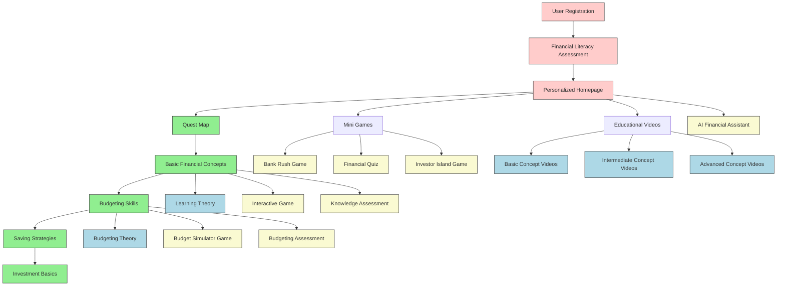

# RaiPlay Application Architecture: Visual Synopsis

This document provides visual representations of how the different components of the RaiPlay financial literacy application connect and work together.

## 1. High-Level System Architecture

## 2. Component Interaction Flow

## 3. Data Flow Architecture

## 4. Backend Module Dependencies

## 5. Frontend Module Organization

## 6. Authentication and Data Security Flow

## 7. Gamification System Architecture

## 8. Database Entity Relationship

## 9. Application Communication Protocols

## 10. Learning Journey Flow

These diagrams provide a comprehensive visual representation of how the different components of the RaiPlay financial literacy application are interconnected and work together to deliver a cohesive learning experience.